1.进入飞桨平台后，点击左侧项目，再出现以下界面，再点击右上角创建项目。
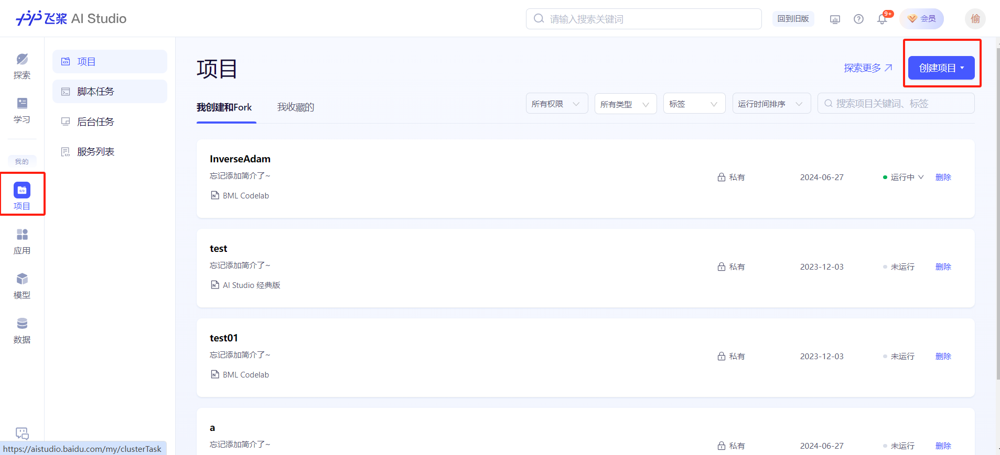
2.选择notebook。
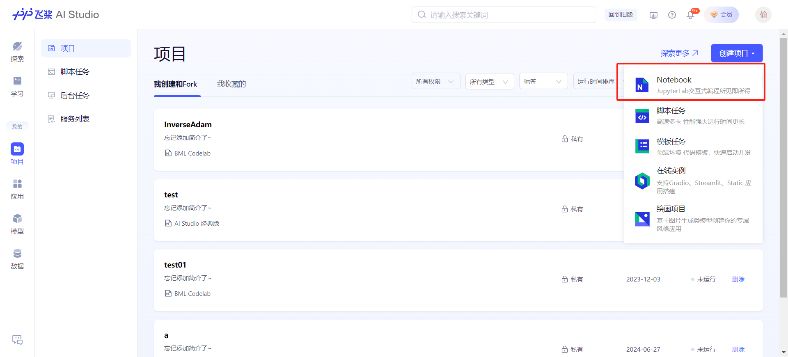
3.输入项目名字，点击创建。
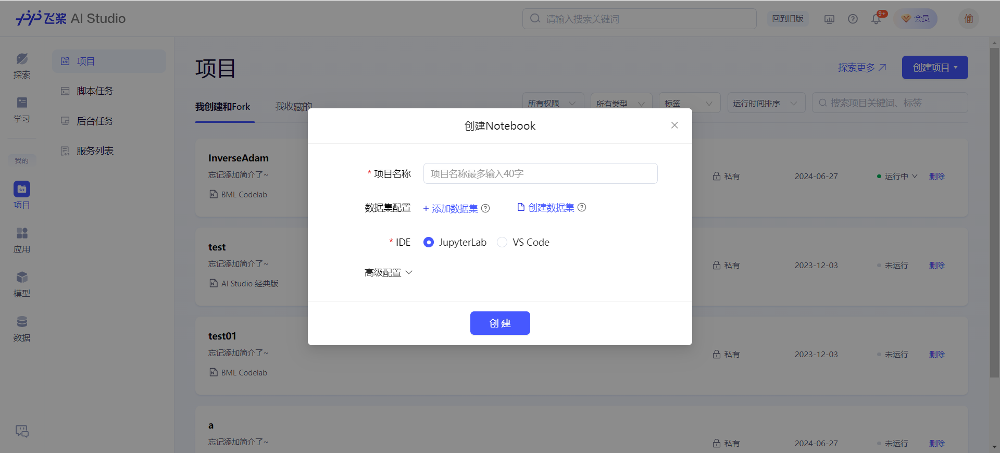
4.创建完成后，点击启动环境。
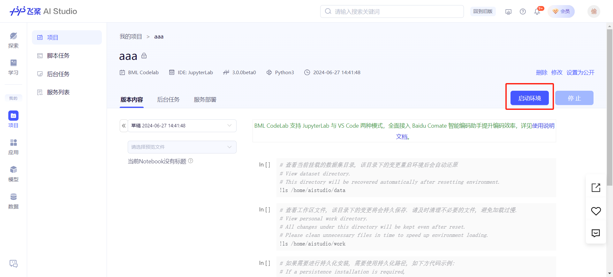
5.选择一个算力，免费的基础版是只有cpu没有gpu的。
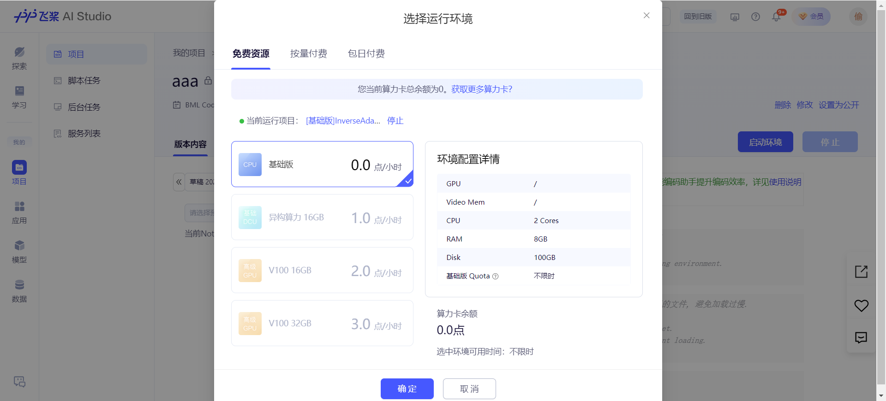
6.进入环境后，可以看到系统自动创建了一个main.ipynb的nootbook文件，平台提供了交互式编程能力。但是使用这个能力必须使用百度的PaddlePaddle库，不能使用pytorch。
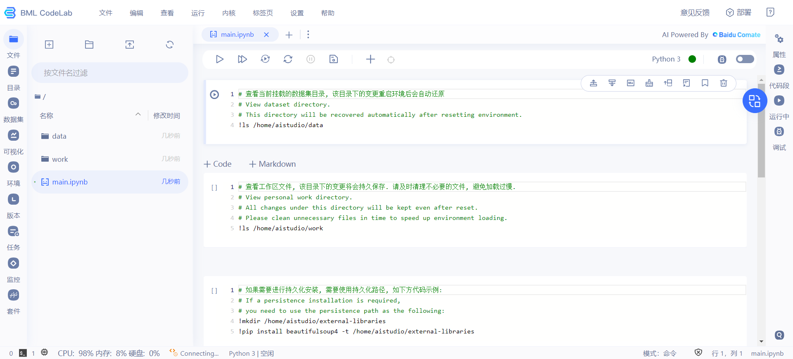
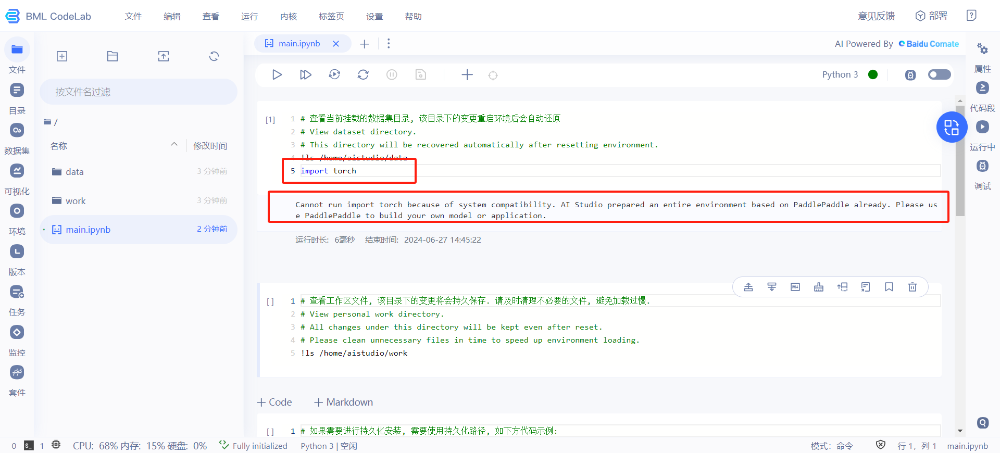
7.因此我们不使用这个功能，而是通过终端直接调用python来执行我们的代码。点击左上角的新建启动项来开启终端。
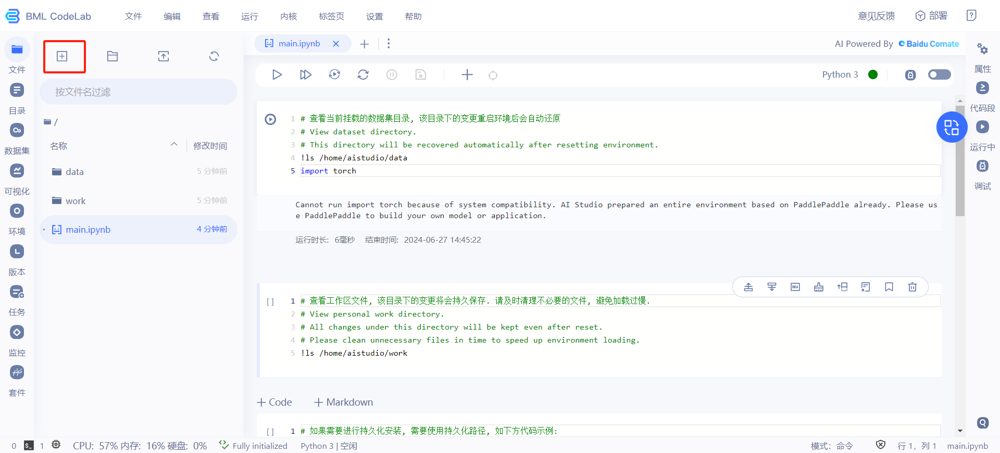
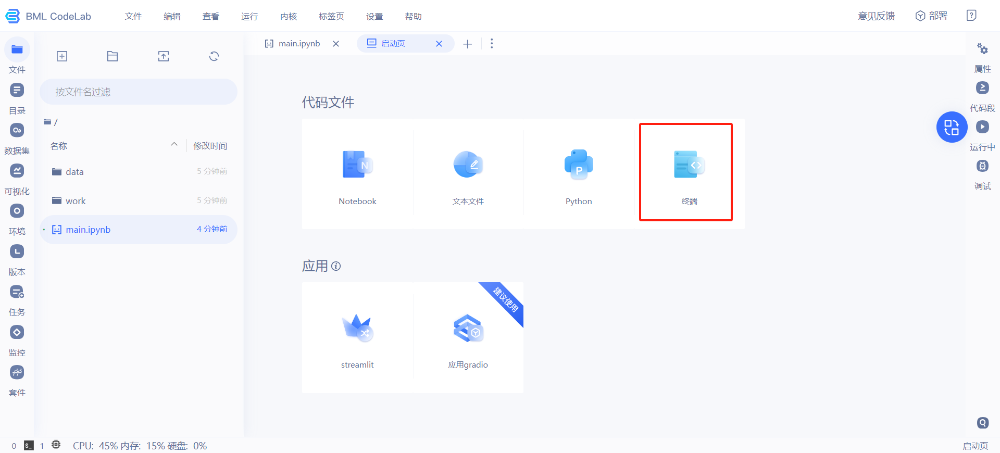
8.创建终端后，可以看到我们目前所在路径即是左侧所展示的路径。
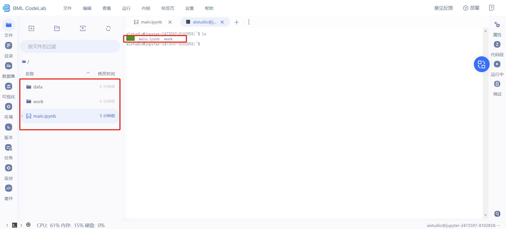
9.平台已经配置好了git和conda，这样我们就可以根据自己需求配置环境运行代码。
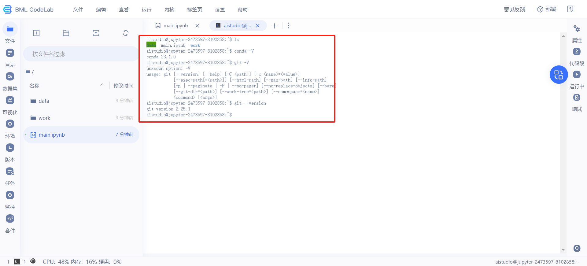
## Bug解决：Segmentation fault (core dumped)
如果我们直接使用python XXX的命令运行我们的训练代码，很可能出现以下报错：
```bash
Segmentation fault (core dumped)
```
这时我们可以通过执行以下命令解决：
```bash
export LD_LIBRARY_PATH=/home/你的用户名（通常是aistudio）/anaconda3/envs/你的conda虚拟环境名/lib:$PATH
```
## 配置pytorch
使用conda或pip的默认源配置pytorch和torchvision等库时很可能下载速度极慢，遇到这种情况可以指定清华源进行下载，代码如下：
```bash
pip3 install torch torchvision torchaudio --index-url https://pypi.tuna.tsinghua.edu.cn/simple
```
## 注意！每次重启环境后，都需要重新配置各种东西，包括创建conda虚拟环境，下载各种包等，所以请慎重重启环境！